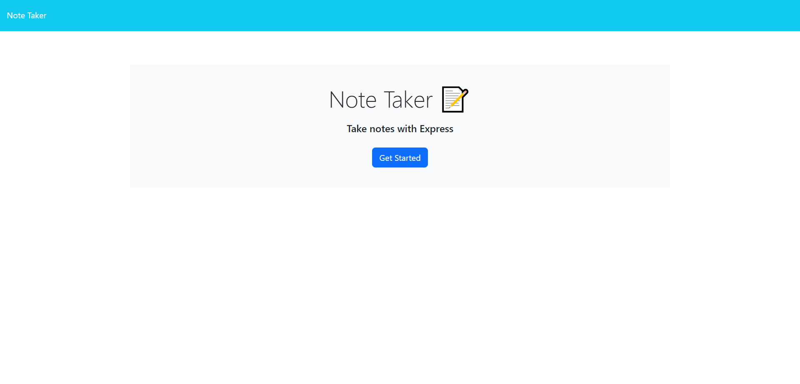
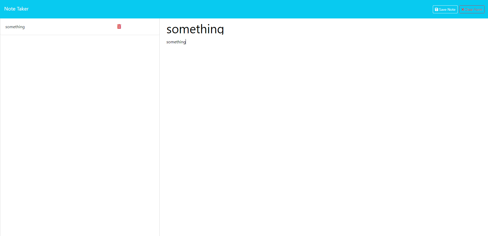

# Note Taker

## Description
This application provides a simple way for you to get your notes, saving new notes and deleting a note so that you can store important information. 
To visit our deployed website, click on this link: https://still-wildwood-36749-c1fe27abbaa7.herokuapp.com/

## Table of Contents
- [Installation](#installation)
- [Usage](#usage)
- [License](#license)
- [Contributing](#contributing)
- [Tests](#tests)
- [Questions](#questions)

## Installation
N/A

## Usage

On the landing page, click on "Get started" to be redirected to our note taking page. There, you can view existing notes by clicking on a note in the left panel. To create a new note, enter note title, note text and click on "Save note" to save. 

And to delete an existing note, click on the bin icon of the note.

## Contributing 
N/A

## Tests
N/A

## Questions
If you have any questions and need to contact me, feel free to reach out at lehonguyen00@gmail.com. 
Or visit my [Github](https://github.com/honguyen00) for more information.
